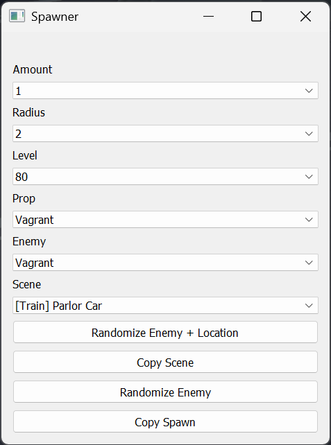

## What is this?

A GUI to spawn enemies in a certain turn-based anime game

## Setup

1. Clone this repository
2. Copy and paste your `Lunar Core Handbook.txt` from LunarCore into the cloned repository folder
3. Specify your UID in `options.py`
4. Run `Setup.bat`
5. Once dependencies have installed, run `python main.py` or `Run.bat`

## How it works

The command is generated via the interface and is sent to the `LunarCore.jar` Command Prompt window by emulating the user copying and pasting it manually.

## How to use

- Amount = Amount of props to spawn
- Radius = How far away/apart the props will spawn
- Level = Level of the enemy
- Prop = The thing that you hit/hits you to initiate the battle
- Enemy = What you're about to be ambushed by
- Scene = Where the battle will take place (Not all scenes will work; check LC console when executing to see if scene is valid)
- `Copy Scene` will load the specified scene
- `Copy Spawn` will spawn the specified enemy/enemies

## Have any suggestions?

Let me know!
